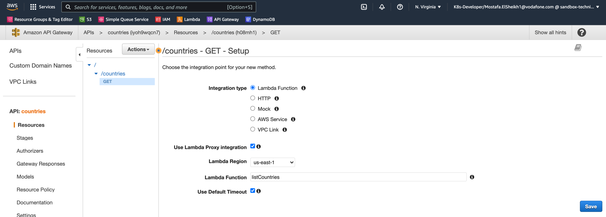
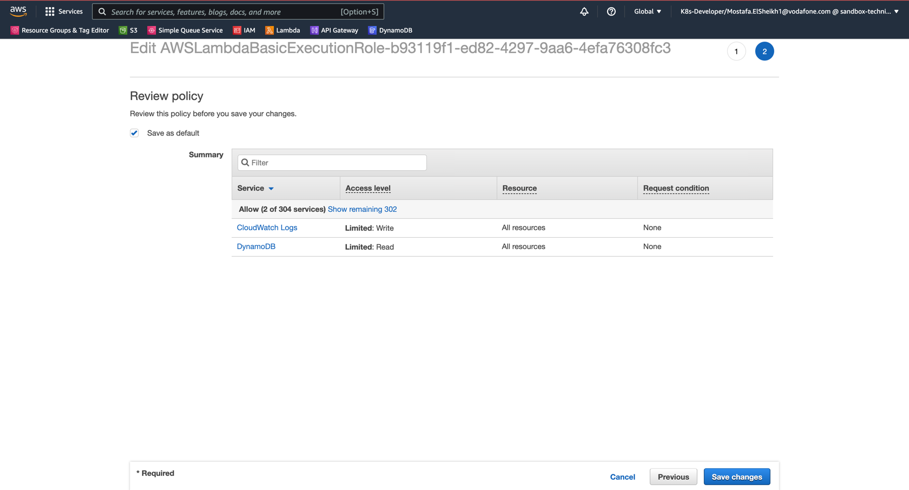

# AWS Developer - Lambda, API Gateway, DynamoDB

## Table of Contents

1. [Task](#task)
   1. [Definition](#definition)
   2. [Acceptance Criteria](#acceptance-criteria)
2. [Getting Started](#getting-started)
   1. [Create Lambda Functions](#create-lambda-functions)
   2. [Create API Gateway](#create-api-gateway)
   3. [Create DynamoDB Table](#create-dynamodb-table)
   4. [Give Permissions to Lambda Functions](#give-permissions-to-lambda-functions)
      1. [listCountries Function](#listcountries-function)
      2. [getCountry Function](#getcountry-function)
      3. [addCountry Function](#addcountry-function)
   5. [Deploy Code](#deploy-code)

## Task

### Definition

Create a Web API that deals with Countries by List/Get/Save them from/in DynamoDB.

### Acceptance Criteria

As a client, I want to deploy Countries API and use REST client to test adding, listing and getting countries.

## Getting Started

### Create Lambda Functions
1. Go to Amazon Lambda
2. Create Lambda Functions with the following names with default execution role option "Create a new role with basic Lambda permissions":
   1. listCountries
   2. getCountry
   3. addCountry
3. Add Environment Variables for each Lambda Function:
   1. Key: TABLE
   2. Value: Countries

### Create API Gateway 
1. Go to Amazon API Gateway 
2. Click on "Create API"
3. Choose "REST API", Click "Build"
4. Name "API name" as "Countries"
5. Click on "Create API"

6. Create Resources and Methods as below hierarchy

7. Setup each Endpoint for each Lambda Function:
   1. listCountries
   
   2. addCountry
   
   3. getCountry
   
   

### Create DynamoDB Table
1. Go to Amazon DynamoDB
2. Click on "Create table"
3. Specify the following: 
   1. Table Name: "Countries"
   2. Partition Key: "ID" of Type: "Number"
   

### Give Permissions to Lambda Functions

1. Go to Amazon Lambda
#### listCountries Function
2. Select "listCountries" Function
3. Select "Configurations" tab -> then "Permissions" tab
4. Click on "Execution role" link
      
5. Click on "Policy name" link
      
6. Click on "Edit Policy"
      
7. Click on "JSON" tab, then Copy & Paste content of [iamRole.json](listCountries/iamRole.json)
      
8. Click on "Review Policy"
      
9. Click on "Save Changes"
#### getCountry Function
10. Select "getCountry" Function 
11. Select "Configurations" tab -> then "Permissions" tab
12. Click on "Execution role" link
       
13. Click on "Policy name" link
       
14. Click on "Edit Policy"
       
15. Click on "JSON" tab, then Copy & Paste content of [iamRole.json](getCountry/iamRole.json)
       
16. Click on "Review Policy"
       
17. Click on "Save Changes"
#### addCountry Function
18. Select "getCountry" Function 
19. Select "Configurations" tab -> then "Permissions" tab
20. Click on "Execution role" link
       
21. Click on "Policy name" link
       
22. Click on "Edit Policy"
       
23. Click on "JSON" tab, then Copy & Paste content of [iamRole.json](addCountry/iamRole.json)
       
24. Click on "Review Policy"
       
25. Click on "Save Changes"

### Deploy Code
1. Package each Function
    ```shell
    ./build.sh -m listCountries
    ./build.sh -m addCountry
    ./build.sh -m getCountry
    ```
2. Click on "Upload from" -> ".zip file"
3. Select each .zip file from "dist" directory for each Function